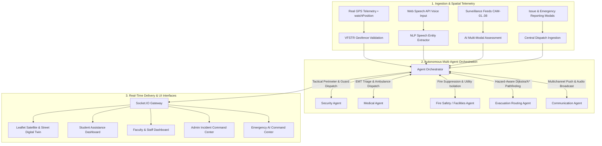

# 🛡️ CAMPUS SENTINEL AI
### Autonomous Multi-Agent Campus Emergency Response & Resource Coordination Digital Twin

> **Location:** Vignan's Foundation for Science, Technology & Research (VFSTR), Vadlamudi, Guntur, Andhra Pradesh, India – 522213  
> **Platform:** Full-Stack Autonomous Multi-Agent Incident Response & Campus Assistance System  
> *Real-time Geofenced GPS Perception → Natural Voice NLP Parsing → Multi-Modal Evidence Analysis → Autonomous Multi-Agent Dispatch → Safety-Weighted Evacuation Routing → Real-time Socket Synchronization → Role-Based Operations Dashboards.*

---

## 📌 1. Executive Summary & Overview

During campus emergencies (fires, medical emergencies, security incidents, severe weather, crowd surges), traditional response mechanisms suffer from communication latency, panic bottlenecks, uncoordinated first-responder dispatches, and lack of real-time spatial awareness.

**Campus Sentinel AI** solves this by establishing a **Live Digital Twin & Location-Aware Emergency Response System** specifically calibrated for the **Vignan University (VFSTR) Vadlamudi Campus**:
- **Real Campus Geofencing**: Point-in-Polygon (Ray-Casting) boundary verification covering the entire VFSTR Vadlamudi campus (~16.2300°N–16.2375°N, 80.5455°E–80.5540°E).
- **Location-Aware Real GPS**: Browser Geolocation API (`navigator.geolocation.watchPosition`) tracking true physical coordinates with automated accuracy and geofence state management.
- **15 Verified Official Locations**: Exact geotagged coordinates for academic blocks, research labs, hostels, dining halls, sports stadiums, and official safe assembly zones.
- **Emergency AI Voice Perception**: Natural voice recognition that automatically extracts structured incident types, campus blocks, floors, and rooms from spoken descriptions in real time.
- **Interactive Satellite & Street Digital Twin Map**: High-resolution Esri World Imagery aerial maps and OpenStreetMap street networks with dynamic hazard perimeters and green evacuation corridors.
- **Multi-Agent Autonomous Orchestration**: Autonomous agents (Incident Commander, Security, Medical/EMT, Fire & Facilities, Evacuation Routing, and Communications) collaborate in real time.
- **Role-Based Operations Portals**: Tailored interfaces for Students, Faculty/Staff, Department Heads/Admin, and Emergency AI Command.

---

## 🏛️ 2. Verified Vignan Campus Locations & Safe Zones

The digital twin models the **15 official campus locations** with verified geotagged coordinates:

| # | Location ID | Official Name & Category | Verified Latitude | Verified Longitude | Safe Assembly Zone |
|---|---|---|---|---|:---:|
| 1 | `A_BLOCK` | **A-Block (Administrative Wing)** | `16.232529` | `80.547941` | No |
| 2 | `H_BLOCK` | **H-Block (Visweswaraya Block - Science & Humanities)** | `16.232775` | `80.547798` | No |
| 3 | `NTR_LIBRARY` | **NTR Vignan Central Memorial Library** | `16.233572` | `80.548722` | No |
| 4 | `MHP` | **MHP (Mahati Pranganam Open Air Auditorium)** | `16.231920` | `80.548350` | No |
| 5 | `N_BLOCK` | **N-Block (NTR Vignan Bhavan - CSE & IT)** | `16.234180` | `80.549650` | No |
| 6 | `U_BLOCK` | **U-Block (Aryabhatta Block - Core Engineering)** | `16.233400` | `80.550900` | No |
| 7 | `BOYS_HOSTEL` | **Vignan Vihar Boys Residential Complex** | `16.235120` | `80.552150` | No |
| 8 | `PHARMACY_BLOCK` | **School of Pharmaceutical Sciences** | `16.231420` | `80.549250` | No |
| 9 | `CONVOCATION` | **Convocation Open Lawn (Sangamithra)** | `16.232880` | `80.549120` | 🛡️ **YES (Primary)** |
| 10 | `DINING_HALL` | **Central Student & Staff Dining Hall** | `16.234250` | `80.551180` | No |
| 11 | `PLAYGROUND` | **Main Sports Stadium & Athletic Track** | `16.231150` | `80.551480` | 🛡️ **YES (South)** |
| 12 | `GUEST_HOUSE` | **University VIP Executive Guest House** | `16.233950` | `80.546950` | No |
| 13 | `LARA_CAMPUS` | **Vignan's Lara Institute of Technology & Science** | `16.236250` | `80.550480` | No |
| 14 | `LARA_GATE` | **North Lara Perimeter Gate & Evacuation Exit** | `16.235850` | `80.549180` | 🛡️ **YES (North)** |
| 15 | `PRIYADARSHINI_GIRLS_HOSTEL` | **Priyadarshini Women's Residence Hall** | `16.234650` | `80.547180` | No |

---

## 🏗️ 3. System Architecture



---

## ✨ 4. Key Features & Innovations

1. **Location-Aware Real GPS State Machine**:
   - `🟢 GPS ACTIVE & CALIBRATED`: Valid GPS fix inside campus with accuracy $\le 50\text{ m}$.
   - `🟠 OUTSIDE UNIVERSITY CAMPUS`: Real location is outside campus perimeter. Prompts user with a helpful safety advisory to select the campus block manually.
   - `🟡 GPS ACCURACY LOW`: Degraded GPS signal ($> 50\text{ m}$).
   - `⚪ GPS PERMISSION REQUIRED`: Geolocation unavailable or permission denied.
   - *No fake coordinates or silent building snapping.*

2. **Emergency AI Natural Voice Input**:
   - Speak naturally: *"There is a fire accident in A-BLOCK, Room 302, 3rd Floor"*.
   - Automatically populates Incident Type (`FIRE`), Campus Block (`A-BLOCK`), Floor (`3rd Floor`), Room (`Room 302`), and Specific Area (`Room 302, 3rd Floor`).

3. **Digital Twin Interactive Map**:
   - Satellite View via Esri World Imagery aerial tiles + Street & Roads View via OpenStreetMap.
   - Verified cyan geofence boundary polygon.
   - Dynamic Haversine distance calculations from the user to every campus building.
   - Floating telemetry card showing live coordinates, weather, rainfall, institutional zone, and nearest building.

4. **Multi-Category Campus Issue Reporting**:
   - Quick reporting for **Classroom Issues**, **Transportation Issues**, **Medical Assistance**, and **General Campus Infrastructure**.
   - Photo and video attachment support with instant AI structuring and automatic departmental routing (Transport, Medical, Security, Admin).

5. **Live Evacuation Guidance & Road Blockage Simulation**:
   - Safety-weighted pathfinding routes evacuees away from active danger radii directly to verified safe assembly zones (Convocation Lawn, Stadium, Lara Gate).
   - Real-time road blockage simulation triggers dynamic re-routing around compromised pathways.

---

## 🛠️ 5. Technology Stack

- **Frontend**:
  - React 18 + Vite
  - Tailwind CSS + Vanilla CSS Design System (Sleek Dark Cyber Operations Theme)
  - Leaflet + React-Leaflet (Vector & Satellite Digital Twin Mapping)
  - Lucide React (High-contrast operational icons)
  - Web Speech API (Browser-native speech recognition)
  - Socket.IO Client (Low-latency bidirectional state sync)
- **Backend**:
  - Node.js + Express.js (REST API & WebSockets)
  - Socket.IO Server
  - In-Memory Digital Twin State Store with JSON persistence
  - Custom Dijkstra / A\* Graph Routing & Point-in-Polygon Geofence Engine
  - Multi-Agent Orchestrator Service

---

## 🚀 6. Installation & Quickstart

### Prerequisites
- **Node.js** v18+ (tested on v20 and v24)
- **npm** v9+

### 1. Clone the Repository
```bash
git clone https://github.com/Nikhitha118/Agent_Nexus.git
cd campus-ai
```

### 2. Configure Environment Variables
Copy the example environment files:
```bash
# Frontend
cp frontend/.env.example frontend/.env

# Backend
cp backend/.env.example backend/.env
```

### 3. Install Dependencies
```bash
# Install frontend dependencies
npm install --prefix frontend

# Install backend dependencies
npm install --prefix backend
```

### 4. Run the Full Application
In two separate terminal windows:

**Terminal 1 (Backend):**
```bash
cd backend
npm start
```
*Backend runs on `http://localhost:5000` with WebSocket gateway active.*

**Terminal 2 (Frontend):**
```bash
cd frontend
npm run dev
```
*Frontend runs on `http://localhost:5173/`.*

---

## 🔑 7. Role-Based Login Credentials

Each university role has pre-configured credentials for demonstration and testing:

| Role | Username / ID | Password | Authority & Capabilities |
|---|---|---|---|
| 🎓 **Student** | `student` or `student@vignan.edu` | `student123` | Campus Assistance, Issue Reporting, Emergency AI Voice Alert, Live Evacuation Map |
| 👩‍🏫 **Faculty / Staff** | `faculty` or `faculty@vignan.edu` | `faculty123` | Department Triage, Student Reports View, Emergency Evacuation Coordination |
| 👨‍💼 **Administrator / Dean** | `admin` or `admin@vignan.edu` | `admin123` | Full Incident Command, Multi-Agent Approvals, Resource Allocation, Audit Ledger |
| 🤖 **Emergency AI** | `ai` or `ai@vignan.edu` | `ai123` | Autonomous Simulation Engine, Multi-Agent Dispatch Monitor, Live Sensor Feeds |

> **Tip:** You can type credentials directly into the Secure Access Portal or click any role card on the login screen for 1-click instant login!

---

## 🧪 8. Test Suites & Verification

To run the automated verification test suites:

```bash
# Run backend multi-agent and digital twin tests
npm test --prefix backend

# Run emergency voice NLP entity extraction test suite
node backend/test_speech_parser.js

# Run frontend production build validation
npm run build --prefix frontend
```

---

## 📡 9. API Reference Summary

| Method | Endpoint | Description |
|---|---|---|
| `GET` | `/api/health` | System health check and agent status |
| `GET` | `/api/campus/overview` | Campus center coordinates, 15 building dataset, and cameras |
| `GET` | `/api/campus/graph` | 23 graph nodes, 29 edges, and road network |
| `GET` | `/api/incidents/active` | Current active emergency incident and agent plans |
| `POST` | `/api/incidents/simulate` | Triggers emergency scenario (`FIRE`, `MEDICAL`, `SECURITY`, `WEATHER`, `CROWD`) |
| `POST` | `/api/incidents/block-route` | Simulates road blockage and triggers dynamic re-routing |
| `POST` | `/api/approvals/:id/decision` | Human-in-the-loop operator decision (`APPROVED`, `REJECTED`) |
| `POST` | `/api/ai/report-nlp` | Natural language emergency entity extraction |
| `GET` | `/api/reports` | Fetches submitted campus assistance reports with status filters |
| `POST` | `/api/reports` | Submits a new multi-modal campus issue report |
| `PATCH` | `/api/reports/:id/status` | Updates report resolution status and audit timeline |

---

## 📜 10. License & Acknowledgements

Developed for **Vignan's Foundation for Science, Technology & Research (VFSTR)** emergency response innovation and campus safety management.
