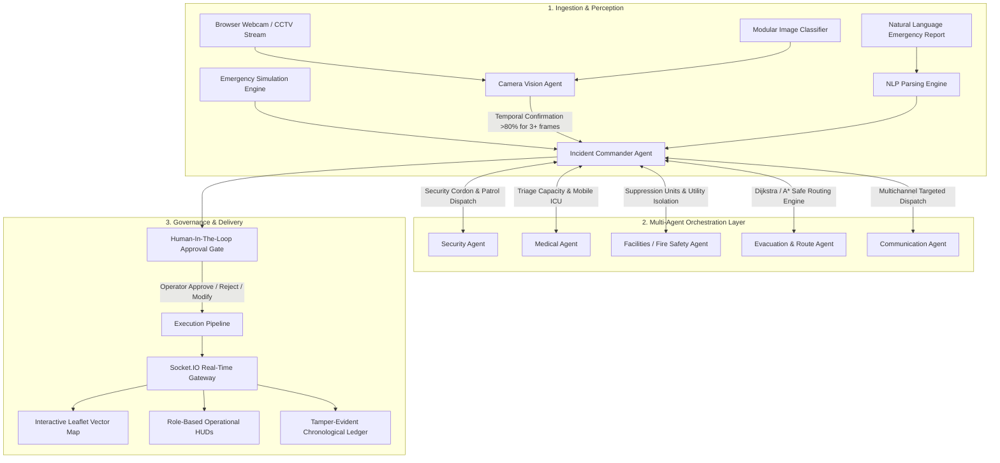

# 🛡️ CAMPUS SENTINEL AI
### Autonomous Multi-Agent Campus Emergency Response & Resource Coordination Digital Twin

> **Hackathon-Ready Enterprise Web Platform**  
> *Real-time Edge Vision Perception → Temporal Verification → Autonomous Multi-Agent Orchestration → Safety-Weighted A\* Evacuation Routing → Segregated Responder Transit → Dynamic Real-time Re-Planning → Human-in-the-Loop Governance & Tamper-Evident Audit Trails.*

---

## 1. Problem Statement & Executive Summary

During campus emergencies (fires, chemical leaks, medical traumas, security breaches), traditional emergency response suffers from critical delays, panic bottlenecks, uncoordinated first-responder dispatches, and rigid static evacuation plans that send students directly into spreading hazard zones.

**Campus Sentinel AI** creates an **Emergency Digital Twin** of the university campus. By linking optical CCTV feeds/webcams with a 32-node weighted navigation graph and autonomous specialized AI agents, the platform continuously assesses threats, eliminates false alarms with temporal confirmation buffers, calculates the **safest** (not just shortest) evacuation route, balances crowd load across assembly zones, dispatches nearest first responders, and **dynamically re-plans alternative safe routes in real time** when road blockages occur.

---

## 2. System Architecture



---

## 3. Autonomous Multi-Agent Hierarchy

| Agent | Core Responsibilities | Key Output / Metrics |
|---|---|---|
| **Incident Commander Agent** | Strategic assessment, severity matrix evaluation, agent aggregation, action matrix formulation | Emergency directives, approval queues |
| **Camera Vision Agent** | Optical stream analysis, temporal frame verification buffer (>80% consecutive) | Anomaly confidence, bounding boxes |
| **Security Agent** | Spatial Euclidean matching, perimeter containment cordon, officer dispatch | Unit assignment (`S-04`), gate lockdowns |
| **Medical Agent** | Triage demand calculation, trauma station staging, nearest ambulance transit | Mobile ICU assignment (`A-02`), EMT squad (`M-03`) |
| **Facilities Agent** | Fire tender mobilization, gas line shutoff (`GV-01`), HVAC smoke dampers | Tender dispatch (`FSU-03`), suppression arming |
| **Evacuation / Route Agent** | Safety-weighted Dijkstra & A\* pathfinding, crowd-aware assembly balancing | Glowing safe route, responder route |
| **Communication Agent** | Multichannel role-targeted alerts (Student, Staff, Security, Medical) | Real-time push, PA synthesized chimes |

---

## 4. Key Hackathon Innovations & WOW Features

1. **Live Camera Detection Studio (`/LiveCameraStudio`)**:
   - Real browser webcam integration via `navigator.mediaDevices.getUserMedia`.
   - Live AI bounding box overlays with confidence progression.
   - Temporal confirmation thresholding ($<60\%$ Anomaly, $60-80\%$ Suspicious, $>80\%$ for consecutive frames triggers alarm) to prevent false alerts.
   - Prominent **"🔥 DEMO FIRE DETECTION"** button for judge demonstrations.
2. **Safety-Weighted $A^*$ Evacuation Algorithm**:
   - Calculates path cost based on distance + exponential thermal hazard proximity penalty + crowd congestion ratio + obstacle blockages:
     $$\text{Cost}(e) = \text{Distance} + W_{\text{hazard}} \cdot \left(\frac{\text{Radius} - \text{dist}}{\text{Radius}}\right) + W_{\text{crowd}} \cdot \left(\frac{\text{Occupancy}}{\text{Capacity}}\right) + \text{BlockedPenalty}$$
3. **Dynamic Re-Planning Engine**:
   - Simulate a road blockage during an active emergency $\rightarrow$ the Evacuation Agent automatically detects the obstacle, recalculates the alternative safe route, pushes updates over WebSockets, and alerts affected users.
4. **Human-in-the-Loop Governance Gate**:
   - High-impact AI recommendations (gas main isolation, electronic door lockouts, building suppression deluge) require operator approval (`APPROVE`, `MODIFY`, `REJECT`) with tamper-evident audit logging.
5. **Role-Based Operational HUDs**:
   - 1-Click switcher between **Incident Commander (Admin)**, **Student (Civilian)**, **Security Officer (Tactical)**, **Paramedic (Triage)**, and **Faculty (Warden)**.
6. **Natural Language Emergency Reporting (NLP)**:
   - Plain English emergency description parsing (`"Smoke is coming from the 2nd floor of CSE building and 400 students are nearby"`) with automatic entity extraction.
7. **Printable Post-Incident Debrief Report**:
   - Generates official debrief documentation with audit hashes, timelines, map snapshot, and responder action logs.

---

## 5. Technology Stack

- **Frontend**:
  - React 18 + Vite
  - Tailwind CSS (Dark Operations Command Center aesthetic)
  - Leaflet & React-Leaflet (Interactive vector digital twin mapping with dark Carto tiles)
  - Lucide React (Tactical iconography)
  - Socket.IO Client (Zero-latency bidirectional event synchronization)
  - Web Audio API (Synthesized tactical sirens, warbles, and chimes)
- **Backend**:
  - Node.js + Express.js (REST API & WebSockets)
  - Socket.IO Server
  - In-Memory Digital Twin State Store with MongoDB Mongoose compatibility
  - Custom Dijkstra / A\* Graph Routing Engine
- **Hardware / Sensors**:
  - Optical Browser Webcam / CCTV IP Camera Feed Emulation
  - 32 Interconnected Graph Nodes & 50+ Weighted Edges

---

## 6. Installation & Quickstart

### Prerequisites
- Node.js v18+ (tested on v24)
- npm v9+

### 1. Clone & Enter Project
```bash
cd campus-ai
```

### 2. Start Backend Server
```bash
cd backend
npm install
npm start
```
*Backend will start on `http://localhost:5000` with the Socket.IO gateway active.*

### 3. Start Frontend App (in a separate terminal)
```bash
cd frontend
npm install
npm run dev
```
*Frontend will launch on `http://localhost:5173/`.*

---

## 7. Role-Based Login Credentials

Each role category has dedicated Login IDs and Passwords for demonstration and testing:

| Role Category | Login ID / Email | Username | Password | Assigned Persona & Authority |
|---|---|---|---|---|
| 👨‍💼 **Admin / HOD / Dean** | `admin@vignan.edu` | `admin` | `admin123` | Dr. K. Ramamurthy (Full Command & Approvals) |
| 👩‍🏫 **Faculty / Staff** | `faculty@vignan.edu` | `faculty` | `faculty123` | Prof. Ananya Sharma (Classroom Evac & Headcount) |
| 🎓 **Student** | `student@vignan.edu` | `student` | `student123` | Rahul Verma (Safe Walking Guidance) |
| 🛡 **Campus Security** | `security@vignan.edu` | `security` | `security123` | Sgt. Sarah Chen (Perimeter Cordon & Gate Control) |
| 🏥 **Medical & Paramedic** | `medical@vignan.edu` | `medical` | `medical123` | Dr. Karen Thorne (Ambulance Staging & Triage) |
| 🤖 **Emergency AI** | `ai@vignan.edu` | `ai` | `ai123` | Sentinel Autonomous AI Engine (Judge View) |

> **Tip**: You can either type the credentials manually into the login form or click any role card on the **Switch Role** page for 1-click auto-login!

---

## 8. Environment Variables (`.env.example`)

### Backend (`/backend/.env`)
```env
PORT=5000
NODE_ENV=development
CLIENT_URL=http://localhost:5173
AI_PROVIDER=LOCAL_SENTINEL_INFERENCE
AI_API_KEY=
MAP_API_KEY=
MONGODB_URI=
```

---

## 8. Exact Steps to Demonstrate the FIRE Emergency to Judges

Follow this script for a presentation:

1. **Open the App**:
   - Navigate to `http://localhost:5173/`.
   - Point out the dark emergency command center theme, top stats, and the vector Leaflet campus map.
2. **Go to Live Camera Studio**:
   - Click **Live Camera Studio** in the sidebar.
   - Show the browser webcam stream or CCTV channel switcher (`CAM-01` to `CAM-08`).
   - Click **"🔥 DEMO FIRE DETECTION"**.
3. **Watch Multi-Agent Sequence Trigger (0 to 12 Seconds)**:
   - Observe the 3-frame temporal confirmation meter jump to 94% CRITICAL.
   - The top banner flashes **ACTIVE CAMPUS EMERGENCY (Main Academic Block)**.
   - The **Incident Commander Agent** synthesizes domain insights.
   - **Security Agent** dispatches Unit `S-04 Delta`.
   - **Medical Agent** dispatches Ambulance `A-02` and Team `M-03`.
   - **Facilities Agent** stages fire tender `FSU-03` and queues gas line `GV-01` shutoff.
   - **Evacuation Agent** draws the **green glowing safe evacuation route** to Assembly Point B.
   - **Communication Agent** broadcasts 4 role-tailored alerts with synthesized audio chimes.
4. **Demonstrate Dynamic Re-Planning (WOW Factor)**:
   - In the Command Center toolbar, click **"⚠️ Simulate Route Blockage (Re-Plan)"**.
   - Notice the road segment turn red with a hazard cross, and the green route dynamically re-route to an unobstructed safe pathway in real time.
5. **Demonstrate Human-in-the-Loop Approval**:
   - In the amber **Human-in-the-Loop Governance Gate**, click **APPROVE** on the gas main isolation action.
   - Notice the status update to *"✓ Action APPROVED by Authorized Operator"* and record to the audit ledger.
6. **Demonstrate Role Views**:
   - Click the **Student** pill in the top navbar: show the simplified safe evacuation HUD and turn-by-turn advice.
   - Click **Paramedic / EMT**: show the medical staging point, triage capacity meter, and ambulance route.
   - Switch back to **Incident Commander**.
7. **Generate Printable Post-Action Debrief Report**:
   - Click **Incident Debrief Report** on the emergency banner to show the audit-hashed printable report.

---

## 9. API Reference

| Method | Endpoint | Description |
|---|---|---|
| `GET` | `/api/health` | System status, version, and orchestration engine health |
| `GET` | `/api/campus/overview` | Campus center coordinates, building count, cameras, and summary stats |
| `GET` | `/api/campus/graph` | 32 nodes, road edges, and dynamic blockage tags |
| `GET` | `/api/incidents/active` | Current active emergency incident and agent plans |
| `POST` | `/api/incidents/simulate` | Triggers emergency scenario (`FIRE`, `MEDICAL`, `SECURITY`, `FLOOD`, `CROWD`) |
| `POST` | `/api/incidents/block-route` | Simulates road blockage and triggers live $A^*$ dynamic re-planning |
| `POST` | `/api/approvals/:id/decision` | Human operator decision (`APPROVED`, `REJECTED`, `MODIFIED`) |
| `POST` | `/api/ai/report-nlp` | Natural language emergency entity extraction |
| `POST` | `/api/agents/frame-analysis` | Ingests camera optical frames and computes temporal buffer |
| `GET` | `/api/audit` | Immutable audit ledger entries with verification hashes |

---

## 10. Safety Protocol Notice

> **Prototype Disclaimer**: Campus Sentinel AI is an autonomous decision-support prototype. High-impact critical operations (utility line isolations, full gate lockouts, mass evacuations) remain subject to authorized human operator verification in compliance with university campus safety regulations.

---

**Built with pride for the Campus AI Hackathon.**
